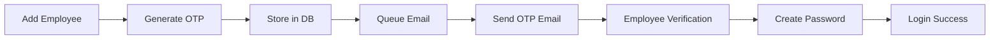

# Sistem Absensi Karyawan Berbasis Lokasi

Sistem absensi modern dengan tema Industrial untuk manajemen multi-outlet dengan teknologi geofencing.

## 🏭 Tentang Sistem

Sistem ini dirancang khusus untuk owner yang memiliki banyak outlet, di mana setiap outlet memiliki karyawan dan lokasi tersendiri. Karyawan dapat melakukan absensi menggunakan geofencing untuk memastikan mereka berada di lokasi kerja yang tepat.

## ✨ Fitur Utama

### 🔐 **Autentikasi & Keamanan**

-   **Multi-Role System:** Owner dan Employee dengan hak akses berbeda
-   **Email Verification:** Verifikasi email dengan OTP 6 digit via queue jobs
-   **OTP System:** One-time password 6 digit dengan expire 10 menit
-   **Queue-Based Email:** Async email processing dengan retry mechanism
-   **Secure Registration:** Pendaftaran owner dengan email verification
-   **Role-Based Middleware:** Proteksi route berdasarkan peran user

### 🏪 **Manajemen Outlet**

-   **Multi-Outlet Support:** Owner dapat mengelola banyak outlet
-   **Interactive Maps:** Pemilihan lokasi outlet dengan Leaflet.js
-   **Geofence Radius:** Setting radius untuk zona absensi
-   **Outlet Details:** Informasi lengkap alamat dan koordinat

### 👥 **Manajemen Karyawan**

-   **Employee Registration:** Owner dapat mendaftarkan karyawan per outlet
-   **Temporary Credentials:** Username/password sementara untuk first login
-   **Email Setup:** Karyawan wajib setup email pribadi saat pertama login
-   **Outlet Assignment:** Karyawan terhubung dengan outlet spesifik

### ⏰ **Sistem Absensi**

-   **Geofencing Technology:** Check-in hanya dalam radius yang ditentukan
-   **Real-time Location:** Menggunakan GPS device karyawan
-   **Check-in/Out Tracking:** Pencatatan waktu masuk dan keluar
-   **Location Validation:** Haversine formula untuk perhitungan jarak
-   **Attendance History:** Riwayat absensi lengkap per karyawan

### 📊 **Laporan & Dashboard**

-   **Owner Dashboard:** Overview semua outlet dan karyawan
-   **Employee Dashboard:** Status dan riwayat personal
-   **Outlet Analytics:** Statistik absensi per outlet
-   **Employee Reports:** Laporan kehadiran karyawan

## 🎨 Tema Industrial Design

### **Palet Warna**

-   **Primer:** `bg-gray-900`, `text-gray-100` (Latar gelap, teks terang)
-   **Sekunder:** `bg-gray-800`, `bg-gray-700` (Kartu, panel)
-   **Aksen:** `bg-orange-500`, `text-orange-400` (Tombol aksi, highlight)
-   **Border:** `border-gray-600`, `border-orange-500`

### **Tipografi**

-   **Heading:** Font Oswald (Google Fonts) - Bold
-   **Body:** Font Roboto (Google Fonts) - Regular

### **Komponen UI**

-   **Tombol:** Solid, `rounded-none`, dengan hover effect
-   **Form:** `bg-gray-800`, `border-gray-600`, fokus `border-orange`
-   **Tabel:** Background bergantian (`bg-gray-800`/`bg-gray-700`)
-   **Ikon:** Heroicons (outline) untuk kesan teknis

## 🛠️ Teknologi

### **Backend**

-   **Framework:** Laravel 11
-   **Authentication:** Laravel Breeze (Vue Stack)
-   **Database:** MySQL/PostgreSQL
-   **Mail:** SMTP Gmail
-   **Validation:** Form Request Classes

### **Frontend**

-   **Framework:** Vue.js 3
-   **Routing:** Inertia.js
-   **Styling:** Tailwind CSS
-   **Maps:** Leaflet.js dengan dark tiles
-   **Icons:** Heroicons
-   **HTTP Client:** Axios

### **Development**

-   **Build Tool:** Vite
-   **Package Manager:** npm
-   **Version Control:** Git

## 📁 Struktur Proyek

```
project/
├── app/
│   ├── Http/
│   │   ├── Controllers/          # Logic aplikasi
│   │   ├── Middleware/           # Autentikasi & autorisasi
│   │   └── Requests/            # Validasi form
│   └── Models/                  # Eloquent models
├── database/
│   ├── migrations/               # Schema database
│   └── seeders/                 # Data dummy
├── resources/
│   ├── js/
│   │   ├── Pages/               # Vue components (halaman)
│   │   └── Components/          # Vue components (reusable)
│   ├── css/                     # Styles & tema Industrial
│   └── views/                   # Blade templates
└── routes/                      # Route definitions
```

## 🗄️ Database Schema

### **Tabel Users**

-   `id`, `role` (owner/employee), `outlet_id` (nullable)
-   `name`, `email`, `email_verified_at`, `password`
-   `remember_token`, timestamps

### **Tabel Outlets**

-   `id`, `name`, `address`
-   `latitude` (decimal 10,8), `longitude` (decimal 11,8)
-   `radius` (integer, default 50m), `owner_id`
-   `timestamps`

### **Tabel Attendances**

-   `id`, `user_id`, `outlet_id`
-   `check_in_time`, `check_out_time`
-   `check_in_latitude`, `check_in_longitude`
-   `check_out_latitude`, `check_out_longitude`
-   `status`, `notes`, `timestamps`

### **Tabel Password Reset Tokens (OTP)**

-   `email` (indexed), `token` (6-digit OTP)
-   `created_at` (untuk expire 10 menit)
-   Digunakan untuk menyimpan OTP sementara

## 🚀 Instalasi & Setup

### **Prerequisites**

-   PHP 8.2+
-   Node.js 18+
-   MySQL/PostgreSQL
-   Composer
-   Git

### **1. Clone Repository**

```bash
git clone <repository-url>
cd absensi
```

### **2. Install Dependencies**

```bash
composer install
npm install
```

### **3. Environment Setup**

```bash
cp .env.example .env
php artisan key:generate
```

### **4. Database Configuration**

Edit `.env`:

```env
DB_CONNECTION=mysql
DB_HOST=127.0.0.1
DB_PORT=3306
DB_DATABASE=absensi
DB_USERNAME=root
DB_PASSWORD=your_password

MAIL_MAILER=smtp
MAIL_HOST=smtp.gmail.com
MAIL_PORT=587
MAIL_USERNAME=your@gmail.com
MAIL_PASSWORD=your_app_password
MAIL_ENCRYPTION=tls
```

### **5. Run Migrations**

```bash
php artisan migrate
```

### **6. Build Assets**

```bash
npm run build
npm run dev
```

### **7. Start Queue Worker**

```bash
php artisan queue:work
```

### **8. Start Server**

```bash
php artisan serve
npm run dev
```

## 📱 Alur Penggunaan

### **Owner Flow**

1. **Register** → Create owner account
2. **Verify Email** → OTP via Gmail
3. **Login** → Access owner dashboard
4. **Create Outlets** → Add multiple outlets with location
5. **Add Employees** → Register employees per outlet
6. **Monitor** → View attendance reports

### **Employee Flow**

1. **First Login** → Use temporary credentials
2. **Setup Email** → Add personal email & verify OTP
3. **Check-in** → Use GPS within outlet radius
4. **Check-out** → End work session
5. **View History** → Personal attendance records

## 🔧 Konfigurasi Gmail SMTP

### **1. Enable 2-Step Verification**

-   Go to Google Account settings
-   Enable 2-Step Verification

### **2. Create App Password**

-   Go to Security → App Passwords
-   Select app: Mail, device: Other
-   Copy generated 16-character password

### **3. Configure .env**

```env
MAIL_USERNAME=your@gmail.com
MAIL_PASSWORD=app_password_here
```

## 🔐 OTP System Documentation

### **OTP Flow Overview**

Sistem menggunakan OTP (One-Time Password) 6 digit untuk verifikasi email karyawan:



### **OTP Configuration**

-   **Length:** 6 digits
-   **Expiry:** 10 minutes
-   **Storage:** `password_reset_tokens` table
-   **Delivery:** Queue-based email jobs
-   **Retry Logic:** 3 attempts dengan backoff [1, 5, 15] menit

### **Queue Management**

```bash
# Start queue worker
php artisan queue:work

# Monitor failed jobs
php artisan queue:failed

# Retry failed jobs
php artisan queue:retry all

# Clear failed jobs
php artisan queue:flush
```

### **Job Class Structure**

```php
// app/Jobs/SendOtpEmail.php
class SendOtpEmail implements ShouldQueue
{
    use Dispatchable, InteractsWithQueue, Queueable, SerializesModels;

    public int $tries = 3;
    public int $backoff = [60, 300, 900]; // 1, 5, 15 minutes

    public function handle(): void
    {
        // Email sending logic
    }

    public function failed(Throwable $exception): void
    {
        // Error logging
    }
}
```

### **Development vs Production**

**Development Mode:**

-   OTP displayed in console/log untuk testing
-   `APP_ENV=local` di `.env`

**Production Mode:**

-   OTP hanya dikirim via email
-   `APP_ENV=production` di `.env`

### **OTP Verification Endpoints**

```php
// Routes untuk OTP
POST /verification/send     // Kirim ulang OTP
POST /verification/verify   // Verifikasi OTP & create password
GET  /verification/notice   // Halaman input OTP
```

## 🌐 Geofencing Technology

Sistem menggunakan **Haversine Formula** untuk menghitung jarak antara lokasi karyawan dengan outlet:

```php
function calculateDistance($lat1, $lon1, $lat2, $lon2) {
    $earthRadius = 6371000; // Earth's radius in meters

    $dLat = deg2rad($lat2 - $lat1);
    $dLon = deg2rad($lon2 - $lon1);

    $a = sin($dLat/2) * sin($dLat/2) +
         cos(deg2rad($lat1)) * cos(deg2rad($lat2)) *
         sin($dLon/2) * sin($dLon/2);

    $c = 2 * atan2(sqrt($a), sqrt(1-$a));

    return $earthRadius * $c; // Distance in meters
}
```

## 🔒 Keamanan

### **Authentication**

-   Laravel Breeze dengan Vue stack
-   Session-based authentication
-   CSRF protection
-   Password hashing (bcrypt)

### **Authorization**

-   Role-based middleware
-   Route protection
-   Resource ownership validation

### **Data Protection**

-   Input validation dengan Form Requests
-   SQL injection prevention (Eloquent ORM)
-   XSS protection (Laravel escape)

## 📱 Responsive Design

Tema Industrial dirancang untuk bekerja optimal di:

-   **Desktop:** Full functionality dengan maps interaktif
-   **Tablet:** Optimized layout untuk manajemen
-   **Mobile:** Essential features untuk check-in/out

## 🚀 Performance Optimization

### **Frontend**

-   Vite untuk fast build
-   Component-based architecture
-   Lazy loading untuk maps
-   Optimized assets

### **Backend**

-   Eloquent relationships yang efisien
-   Database indexing pada foreign keys
-   Query optimization
-   Caching strategy

## 🧪 Testing

### **Run Tests**

```bash
php artisan test
```

### **Test Coverage**

-   Authentication flows
-   Role-based access
-   Geofencing calculations
-   Email verification
-   Database operations

## 📝 Logging & Monitoring

### **Error Handling**

-   Laravel logging system
-   Custom error pages dengan tema Industrial
-   User-friendly error messages

### **Activity Tracking**

-   User activity logs
-   Attendance audit trail
-   System events

## 🔄 Deployment

### **Production Setup**

1. Set environment variables
2. Optimize autoloader: `composer dump-autoload --optimize`
3. Cache configuration: `php artisan config:cache`
4. Cache routes: `php artisan route:cache`
5. Build assets: `npm run build`

### **Server Requirements**

-   PHP 8.2+ dengan extensions:
    -   BCMath, Ctype, Fileinfo, JSON, Mbstring, OpenSSL, PDO, Tokenizer, XML
-   MySQL 8.0+ atau PostgreSQL 12+
-   Node.js 18+
-   Web server (Nginx/Apache)

## 🤝 Kontribusi

1. Fork repository
2. Create feature branch: `git checkout -b feature-name`
3. Commit changes: `git commit -m 'Add feature'`
4. Push to branch: `git push origin feature-name`
5. Submit pull request

## 📄 License

Project ini dilisensikan under MIT License.

## 📞 Support

Untuk bantuan atau pertanyaan:

-   Email: support@example.com
-   Documentation: `/docs`
-   Issues: GitHub Issues

---

**© 2025 Sistem Absensi Karyawan Berbasis Lokasi - Industrial Theme**
