# Diagram Arsitektur Pivot Table Absensi

## 1. High-Level Architecture

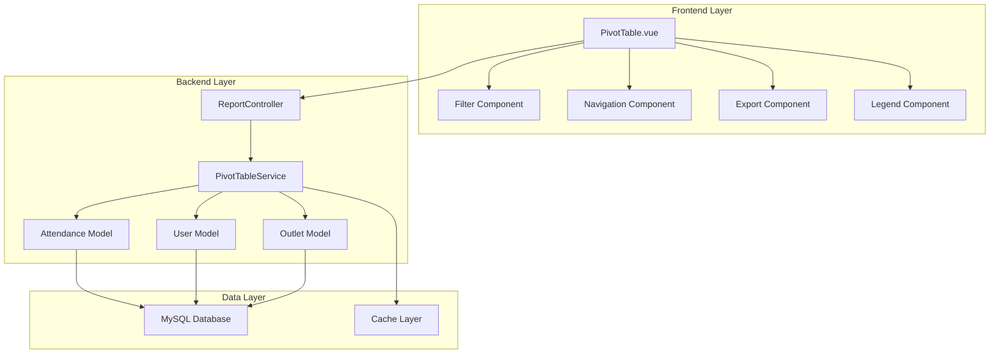

## 2. Data Flow Diagram

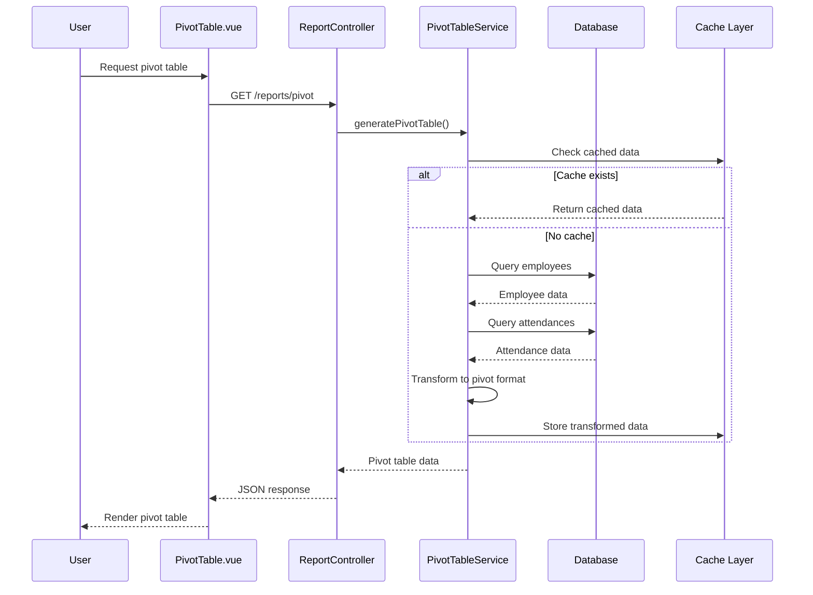

## 3. Pivot Table Data Structure

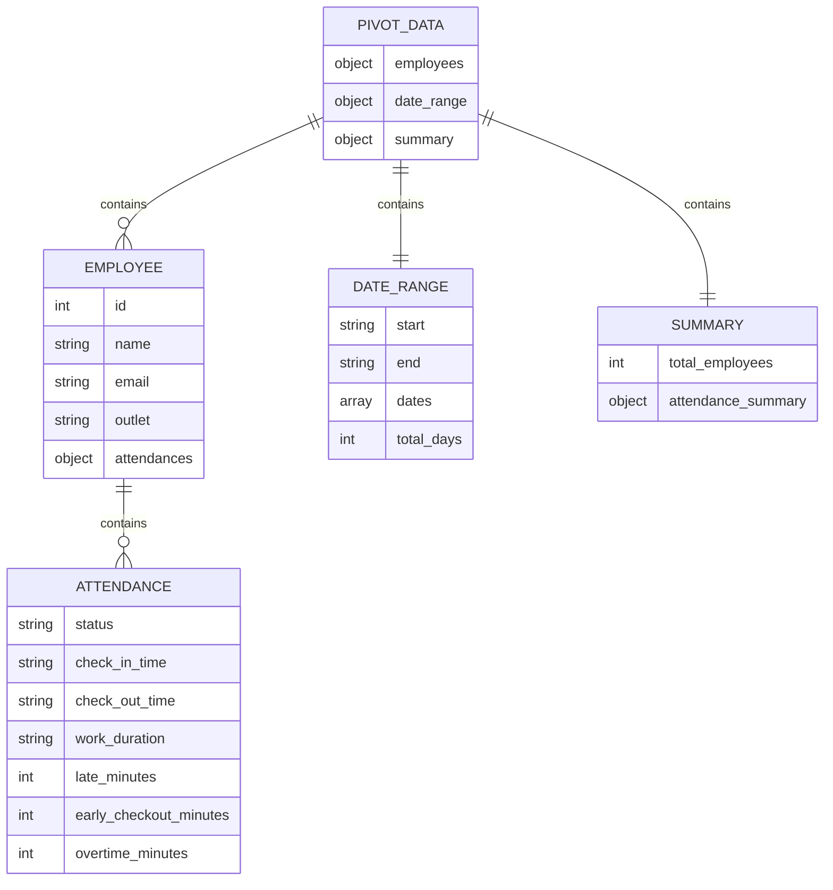

## 4. Component Architecture

```mermaid
graph TD
    A[PivotTable.vue] --> B[Header Section]
    A --> C[Statistics Cards]
    A --> D[Filters & Navigation]
    A --> E[Status Legend]
    A --> F[Pivot Table]

    B --> B1[Title & Description]
    B --> B2[Export Button]

    C --> C1[Total Records]
    C --> C2[On Time Count]
    C --> C3[Late Count]
    C --> C4[Absent Count]
    C --> C5[Attendance Rate]

    D --> D1[Outlet Filter]
    D --> D2[Date Range Filter]
    D --> D3[Apply/Reset Buttons]
    D --> D4[Month Navigation]

    E --> E1[Status Icons]
    E --> E2[Color Codes]
    E --> E3[Status Labels]

    F --> F1[Fixed Employee Column]
    F --> F2[Scrollable Date Columns]
    F --> F3[Status Cells]
    F --> F4[Tooltips]
```

## 5. Service Layer Flow

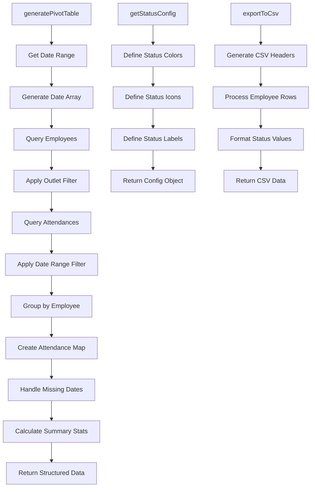

## 6. Database Query Optimization

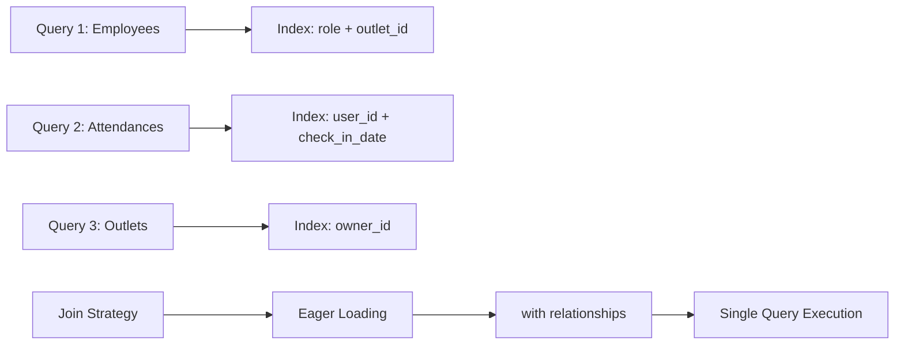

## 7. Caching Strategy

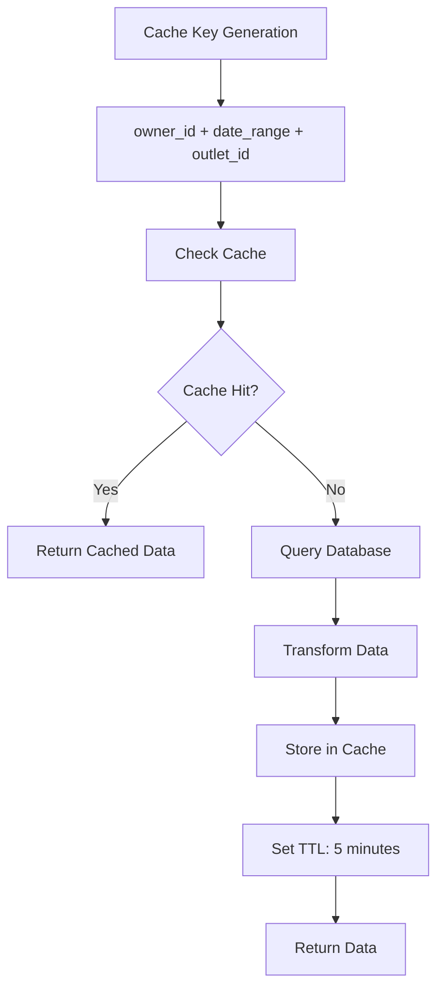

## 8. Frontend State Management

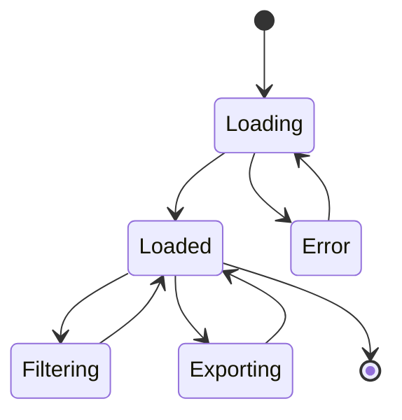

## 9. Responsive Design Breakpoints

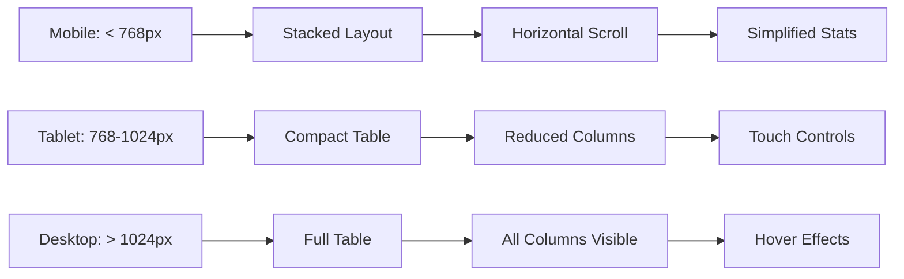

## 10. Performance Optimization Flow

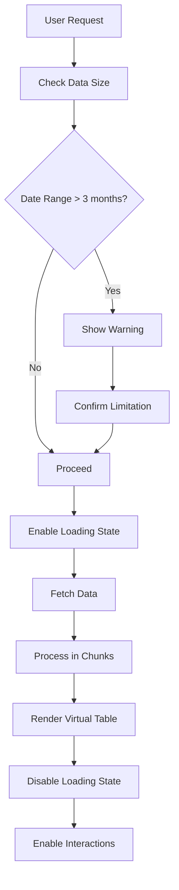

## 11. Error Handling Flow

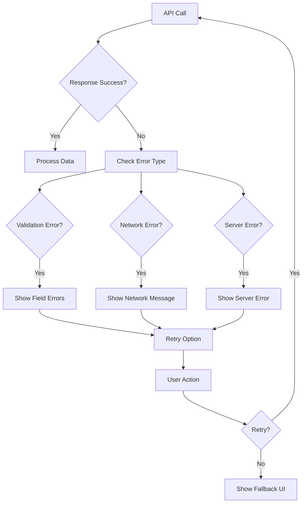

## 12. Export Functionality

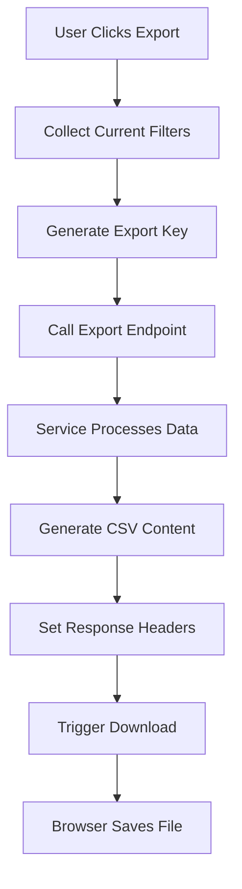

## 13. Navigation Flow

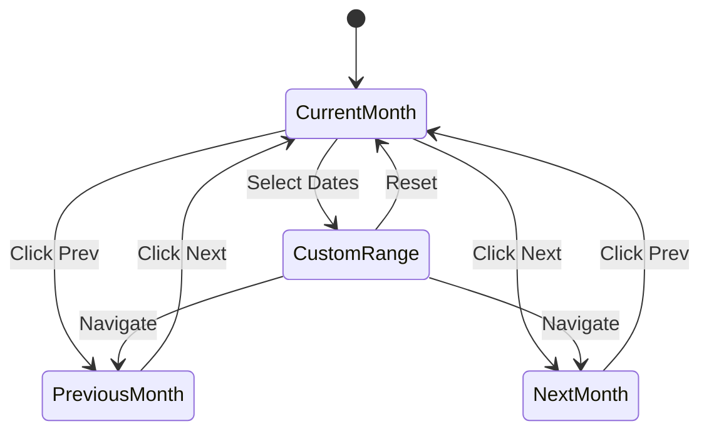

## 14. Component Interaction Map

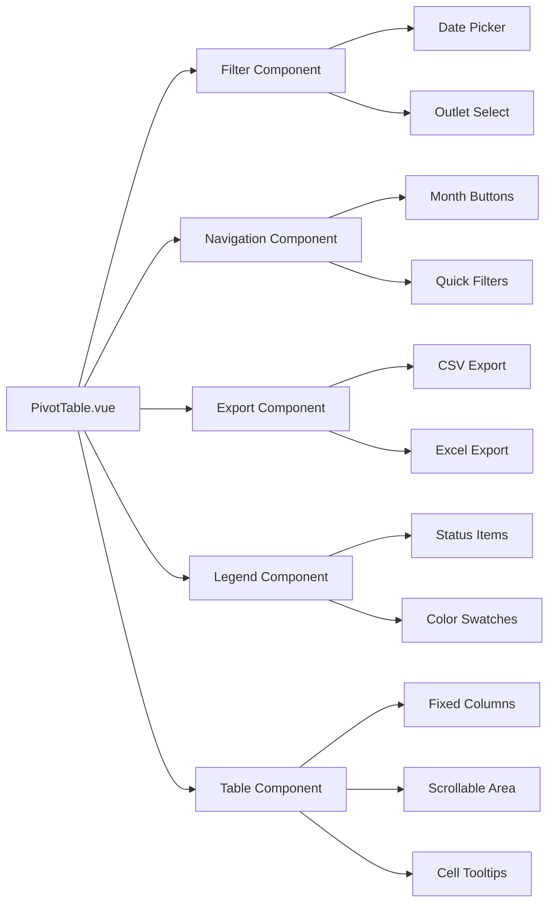

## 15. Security Considerations

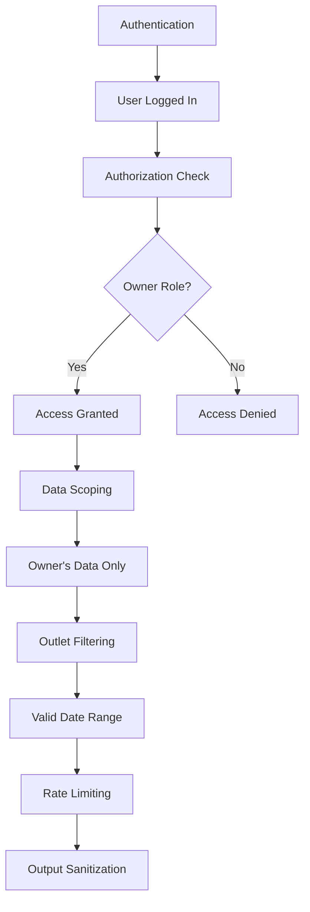
